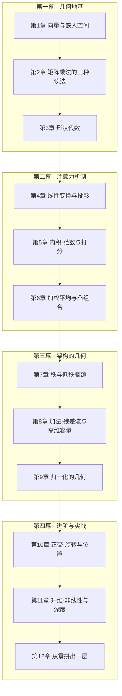

# 看懂 Transformer 所需的线性代数

**一本用「几何直觉」讲清 Transformer 的迷你书**

从 *"一个词是怎么变成 768 个数的？"* 到 *"用 40 行 NumPy 拼出一层 Transformer"*，
全程只讲你真正需要的那点线性代数——**不多讲一个公式，也不少讲一个关键直觉**。

---

## 这本书在解决什么问题？

网上讲 Transformer 的教程有两种通病：

- **要么直接甩公式** —— `Attention(Q,K,V) = softmax(QKᵀ/√d_k)V`，每一块都认识，连起来看不懂；
- **要么只讲用法** —— "调库就行，别管原理"。

这本书选择第三条路：**只保留 Transformer 真正用到的线性代数**，按"它到底在几何上做了什么"的顺序，一章一章把公式翻译成人话。

> 🎯 **读完这本书你能做到**：用 **40 行 NumPy**（不用 PyTorch、不用任何框架）写出
> Pre-Norm + RMSNorm + RoPE + 因果多头注意力 + FFN 的完整一层 Transformer，
> 并且能说出每一步的 reshape、转置、乘法为什么长那个形状。

## 特色

- 🧭 **一条主线到底**：12 章只有一条路径，从"词怎么变成数字"一路走到完整的 Transformer 层，绝不绕路；
- 📐 **几何优先**：每个概念先给直觉与图像——球面、旋转、凸组合、投影……再给最小必要定义；
- 🧱 **与真实代码零偏差**：全书固定"**一行 = 一个 token**"的行约定，公式与真实实现严格对齐，不玩教材式的转置；
- 🎯 **每章可交付**：开头有"本章要回答"，结尾有"读完你能做到"，读没读懂一目了然；
- 🧮 **自带算账工具**：第 12 章给出 `12d²` 参数量估算公式，任意模型的参数量、显存、算力一把算清；
- 📦 **Markdown + PDF 双形态**：仓库里直接看，或下载编译好的 `看懂Transformer所需的线性代数.pdf` 离线阅读。

## 学习路径

全书分四幕，环环相扣：

## 目录

| 章节 | 要回答的问题 | 对应 Transformer 的哪里 |
|---|---|---|
| 第 1 章 · 向量与嵌入空间 | 一个词是怎么变成一串数字的？为什么是 768 个？ | 嵌入层 |
| 第 2 章 · 矩阵乘法的三种读法 | C = AB 到底在做什么？ | 所有线性层 |
| 第 3 章 · 形状代数 | 不运行代码，怎么说出每一步的输出形状？ | reshape / 拆头 |
| 第 4 章 · 线性变换与投影 | 768 维压到 64 维，丢掉的东西去哪了？ | Q / K / V 投影 |
| 第 5 章 · 内积、范数与打分 | 两个向量"像不像"怎么量？为什么要除以 √d_k？ | 注意力打分 |
| 第 6 章 · 加权平均与凸组合 | `attn @ V` 这一行到底在做什么？ | 注意力输出 |
| 第 7 章 · 秩与低秩瓶颈 | 12 个 64 维的头，为什么比 1 个 768 维的头好？ | 多头注意力 |
| 第 8 章 · 加法、残差流与高维容量 | 768 维的空间，凭什么装得下几万个概念？ | 残差连接 |
| 第 9 章 · 归一化的几何 | 减均值、除标准差，在几何上是什么？ | LayerNorm / RMSNorm |
| 第 10 章 · 正交、旋转与位置 | 绝对位置是怎么自动变成相对位置的？ | RoPE |
| 第 11 章 · 升维、非线性与深度 | FFN 占了三分之二的参数，到底在做什么？ | FFN |
| 第 12 章 · 从零拼出一层 | 前十一章能拼成什么？ | 完整 Transformer 层 |

## 每章的内部结构

每章遵循同一个"肌肉记忆"结构：

> **本章要回答** → 最小必要定义 → 几何直觉 → 数值小实验 → **读完你能做到**

## 怎么读这本书

- **前置知识**：会一点 Python、记得高中代数就够了，不需要任何机器学习基础；
- **建议节奏**：每章 20~40 分钟；第 12 章请务必动手把代码敲一遍；
- **阅读顺序**：按章读，不要跳——第 3 章"形状代数"是全书的拐点，之后每一章都会用到它。

## PDF 版

- **在线阅读**：仓库内直接看各章 Markdown；
- **离线阅读**：下载编译好的 [看懂Transformer所需的线性代数.pdf](./看懂Transformer所需的线性代数.pdf)。

## 作者

[刘玉书（YUSHU LIU）](https://github.com/liuyushugreat)

## 许可

 本作品采用 <a rel="license" href="http://creativecommons.org/licenses/by-nc-sa/4.0/">知识共享署名-非商业性使用-相同方式共享 4.0 国际许可协议（CC BY-NC-SA 4.0）</a> 进行许可。
